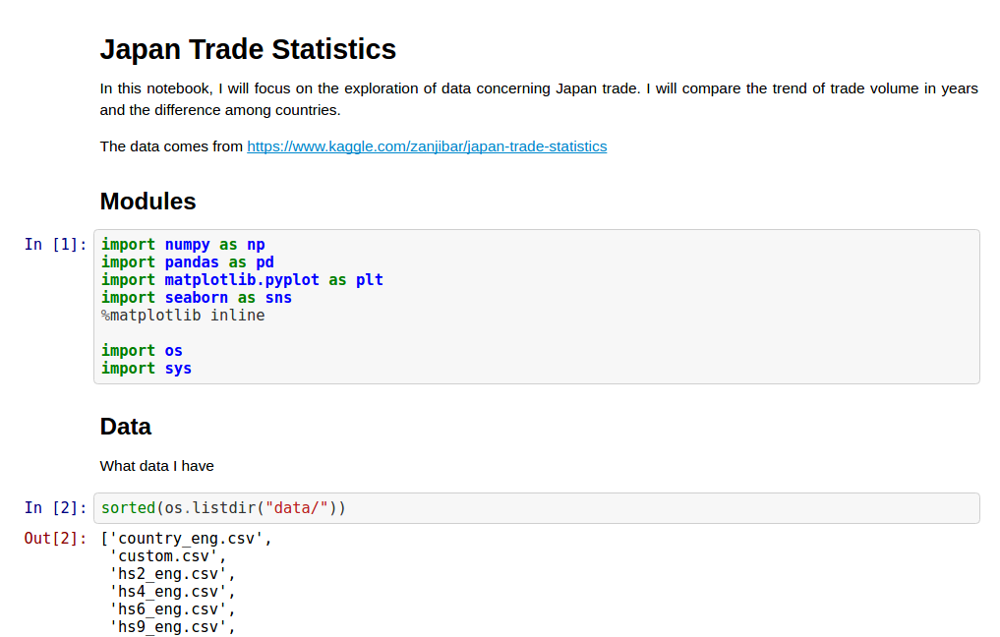

# JapanTradeStatistics

Data analysis on Japan's international trade by country and type of good  
Data Source: https://www.kaggle.com/zanjibar/japan-trade-statistics 
Analysis: http://nbviewer.jupyter.org/github/hncpr1992/JapanTradeStatistics/blob/master/dataExplore.ipynb 

