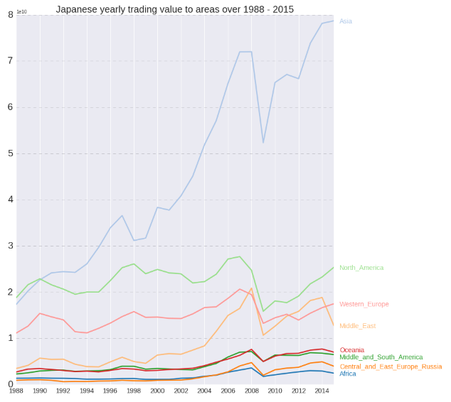
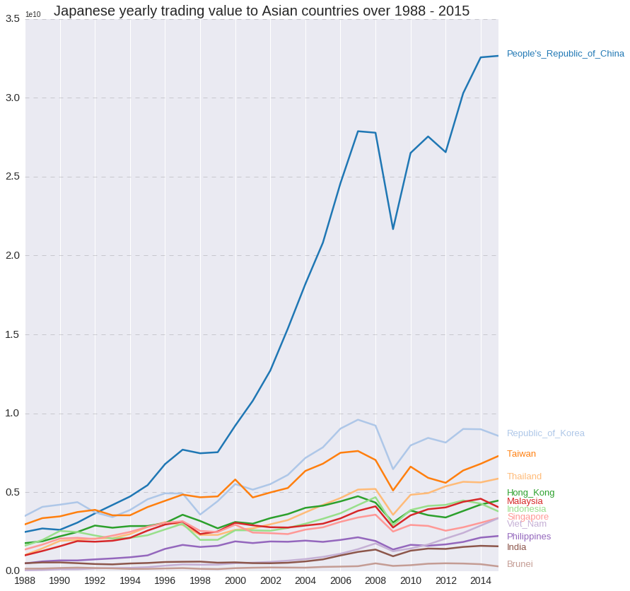

# JapanTradeStatistics

Data analysis on apan's international trade by country and type of good  
Data Source: https://www.kaggle.com/zanjibar/japan-trade-statistics

This graph shows that back to 1988, The North America is the biggest trading partner of Japan, Howver, after 1990, Asia start to replace the position of North America and lead with a very huge gap compared to other areas. 
A following question is: what is the driving force of the sharp increase of Asia since 1990?
We can draw a futher plot for the Asia from 1988 to 2015 but only focus on the top 12 countries in Asia that influence Japan most

Clearly, the dominant driving force of the increase of Japanese trade to the Asian Area is its trade with China.

More to do
